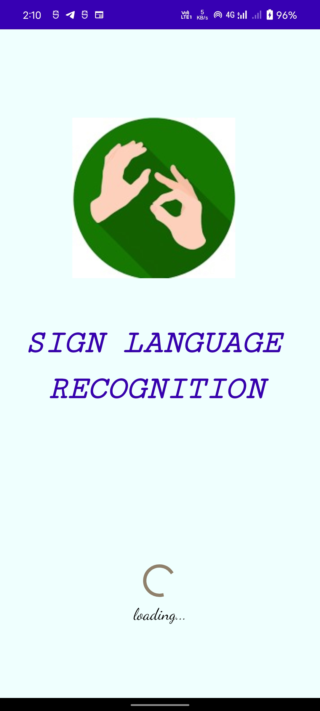
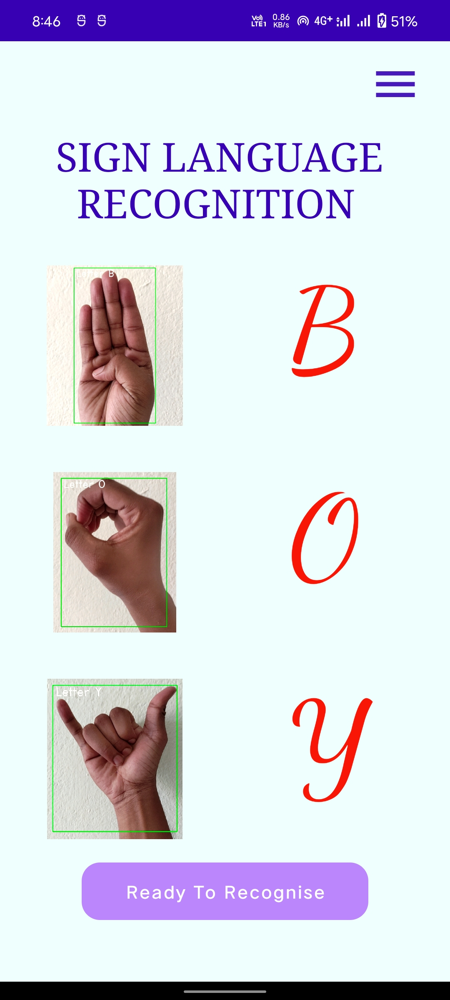
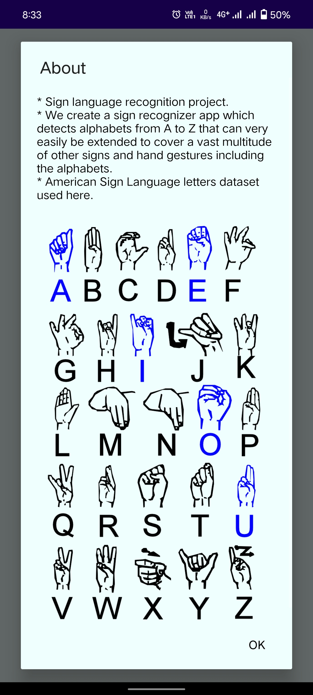
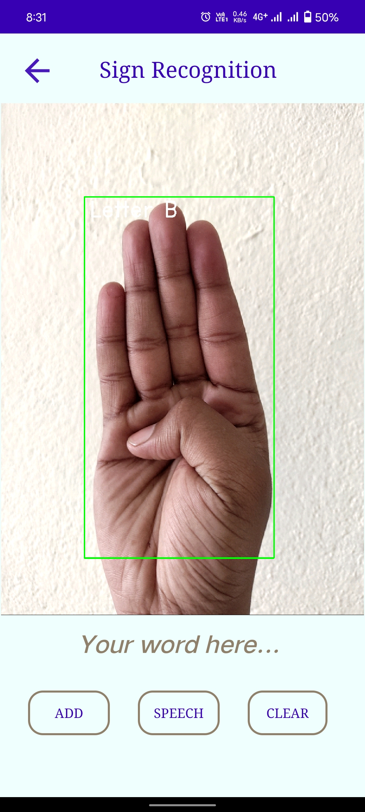
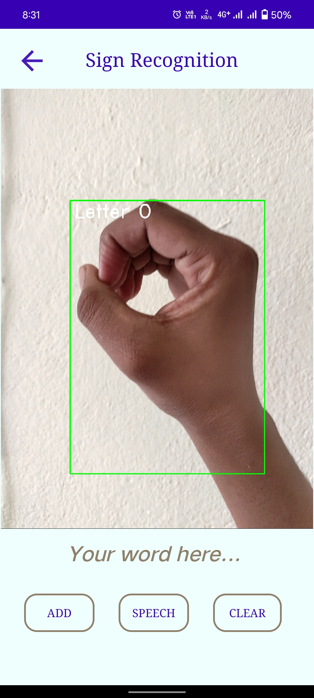
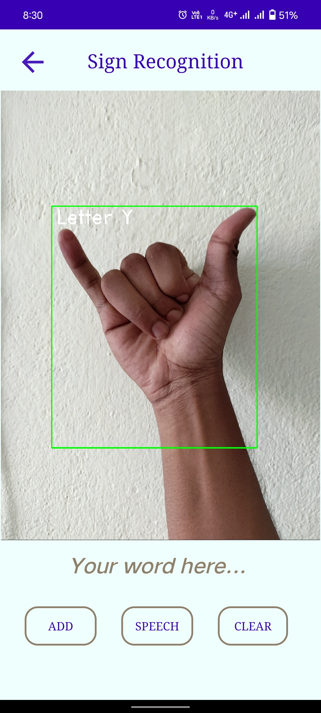

<h1> Sign Language Recognition </h1>

<h4> 
Sign recognizer app which detects alphabets from A to Z that 
can very easily be extended to cover a vast multitude of other signs and hand gestures including the alphabets.
</h4>

<h3> Dependencies/Library: </h3>

<ul>
<li>TensorFlow Library used.</li>
<li>OpenCv Library for detecting images or video</li>
<li>American Sign Language letters dataset used here.</li>
</ul>

<h3> Tech Stack: </h3>

<ul>
    <li>Java</li>
    <li>XML</li>
</ul>

<h3> ScreenShots: </h3>

    
    
    
    
    
    

